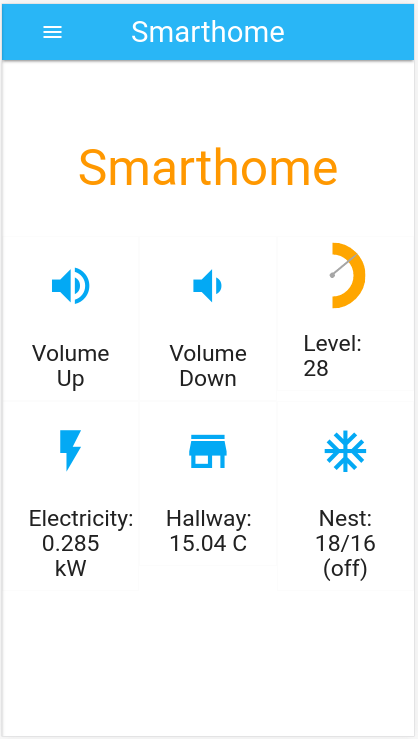
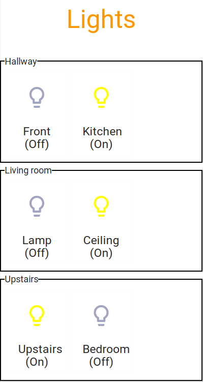

# smarthome: Simple IoT hub and web interface
##### Copyright (C) 2017 Tim Churchard tim.churchard at gmail.com

A simple single page dashboard that provides a volume control for my living room and some stats for my house.



## Setup

1. Get the submodules
```bash
git submodule update --init --recursive
```

2. Install python deps. in virtualenv (Debian/Ubuntu)
```bash
sudo apt-get install python-dev libmysqlclient-dev
sudo apt-get install python3-numpy python3-scipy python3-pyaudio
sudo pip3 install virtualenv
mkdir venv
virtualenv venv
./venv/bin/pip3 install -U -r requirements.txt
./venv/bin/pip3 install -U -r subs/pyloopenergy/requirements.txt
cd subs/pyloopenergy
python3 setup.py install
```

3. Switch to the new environment
```bash
source venv/bin/activate
```


## Hardware

0. Arduino Uno + TMP36 temperature sensor

IoticTemp.py simple fetch temp data from Arduino (running cfg/arduino_tmp36.uno).  Store in DB and publish 10s.

1. Loop Electricity Monitor

Using a [Loop Electricity Monitor](https://www.loopenergysaver.com/) and [pavoni.pyloopenergy](https://github.com/pavoni/pyloopenergy) to record whole house energy usage.
IoticLoop.py

2. RPI3 Sound Monitor + IR Remote for TV Volume
IoticVolume.py

3. Energenie PiMote Socket + RPI2 RF Control (Living room lamp)
IoticLamp.py
Note: Using gpiozero module works best with python2 outside of venv!

4. Lights (IKEA & Philips Hue)
IoticLights.py

5. Amazon Dash
IoticDash_upstairs.py : Turn on/off all upstairs lights.


## Links for lights

https://github.com/ggravlingen/pytradfri

https://github.com/quentinsf/qhue/


## Using scapy in virtualenv

Note: I run IoticDash.py as root !

- switch to root user
- activate venv
- pip3 install scapy-python3
- python3 IoticDash.py

